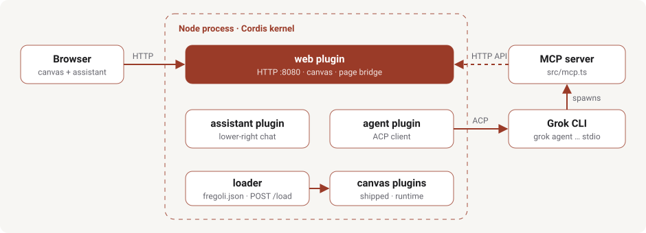

# Fregoli

[](https://github.com/pihme/fregoli/actions/workflows/ci.yml)

Self-evolving web application on a Cordis kernel, named for Leopoldo Fregoli, the quick-change artist. One process, many appearances: plugins load and unload without restarting Node.

The CLI name is `fregoli` in full; do not shorten to `freg`.

- [Website](https://pihme.github.io/fregoli/) — handbook and current status
- [Specification](SPEC.md) — product spec
- [Usage guide](USAGE.md) — CLI, HTTP, Grok, Docker
- [Contributing](CONTRIBUTING.md) — tests, commits, versions

## Getting started

Needs Node 22+. For a real agent, the Grok CLI on `PATH` (authenticated via Grok CLI login or `XAI_API_KEY`).

```bash
git clone https://github.com/pihme/fregoli.git
cd fregoli
npm ci
npx tsx src/cli.ts              # http://127.0.0.1:8080/
npx tsx src/cli.ts --assistant  # force the stock assistant UI
npx tsx src/cli.ts --version
```

A welcome canvas (`plugins/shipped/welcome.ts`) is shown at boot, assistant in the lower right. Chat goes to Grok over ACP when `grok` is available, otherwise an in-process stub. Starting with `--assistant` forces the stock assistant UI for that start.

Run the tests (the merge gate):

```bash
npm test
```

Container image ([Hermetarium](https://github.com/pihme/hermetarium) is a recommended habitat, not a requirement):

```bash
docker build -t fregoli:local .
docker run --rm -p 8080:8080 fregoli:local
```

Note: the server currently listens on `127.0.0.1` inside the container, so the published port is likely unreachable from the host ([#1](https://github.com/pihme/fregoli/issues/1)).

Saved config lives in `fregoli.json` in the process working directory:

```json
{ "assistant": true, "plugins": [] }
```

`fregoli/vX.Y.Z` GitHub Releases attach a source tarball. Local `--version` is `dev` unless `FREGOLI_VERSION` is set. Full CLI and HTTP reference: [usage guide](USAGE.md).

## Architecture



The agent plugin spawns `grok agent --always-approve stdio` and passes the MCP server spec in ACP `session/new`; Grok starts `src/mcp.ts` with `FREGOLI_URL` pointing back at this process. Shipped plugins (`plugins/shipped/`) mount at boot; runtime plugins via `fregoli.json` or `POST /load`.

The **kernel** is Cordis. Capabilities are plugins ("fibers") that can be mounted and disposed at runtime.

**Web** serves HTTP on 8080, the canvas, the assistant slot, a JSON API and the page bridge (DOM snapshot, highlight, user click).

**Agent** spawns `grok agent --always-approve stdio` and speaks ACP. It hands Grok an MCP server: `list_plugins` (mounted Cordis fibers), `load_plugin` (mount a plugin file), `unload_plugin` (dispose a fiber by name), `observe_page` (serialized DOM of the current tab), `highlight` (highlight a CSS selector), `wait_click` (highlight a selector and wait for the user to click or type), `reload_page` (reload the browser tab; assistant chat stays open). Without `grok` it falls back to a stub. Unload kills that child.

**Assistant** is its own plugin: lower-right chat, replaceable and removable.

**Loader** mounts extra Cordis plugins from `fregoli.json` or `POST /load`. A failed `apply` does not become `ACTIVE` and does not replace the canvas.

## Layout

| Path | Contents |
| --- | --- |
| `src/cli.ts`, `src/boot.ts`, `src/kernel.ts` | CLI entry, boot sequence, Cordis context |
| `src/loader.ts`, `src/config.ts` | Plugin loader/unloader, `fregoli.json` handling |
| `src/mcp.ts` | MCP server handed to Grok |
| `src/plugins/{web,agent,assistant}/` | Boot plugins (tracked) |
| `plugins/shipped/` | Canvas plugins shipped with the repo; every `*.ts` mounts at boot |
| `plugins/runtime/` | Plugins the agent writes at runtime (gitignored) |
| `.grok/skills/fregoli-app/` | Grok skill: how to change the running app |
| `tests/` | `node:test` suites run via `tsx` |
| `docs/images/` | Diagrams used in this README and on the website |

License: [PolyForm Noncommercial 1.0.0](LICENSE). Source-available, not OSI Open Source.
